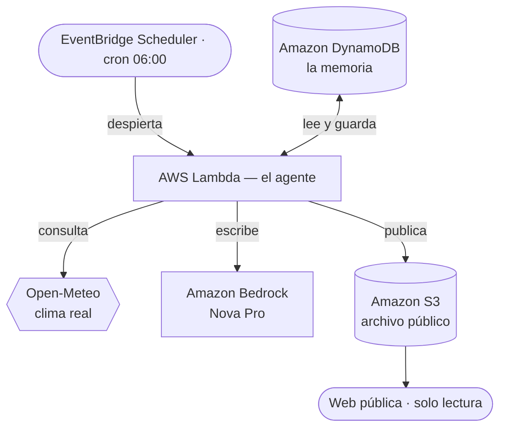

# Postales del Ecuador

Un agente autónomo que vive en AWS. Cada vez que despierta elige un lugar del Ecuador
donde no ha estado, consulta el clima **real** de ese sitio en ese instante, y escribe una
postal literaria. Nadie se lo pide: lo despierta un scheduler.

> **La mejor herramienta es la que nunca tienes que abrir.**

🌐 **Web en vivo:** http://postales-del-ecuador-ec.s3-website-us-east-1.amazonaws.com

Construido para el [AWS Weekend Challenge: Set your creative app free](https://builder.aws.com/content/3HkL1H9G5DVm7ZtpO8EcOt6jZsV/weekend-challenge-set-your-creative-app-free).

---

## Qué hace, paso a paso

Cada ejecución, sin intervención humana:

1. **Lee su memoria** en DynamoDB: dónde ya estuvo y con qué tono ya escribió.
2. **Elige un lugar** entre 50 del Ecuador, descartando los 18 más recientes.
3. **Elige un registro narrativo** entre 12, descartando los 8 usados últimamente.
4. **Consulta el clima real** de esas coordenadas ahora mismo (Open-Meteo, sin API key).
5. **Traduce el clima a sensaciones físicas** — el modelo nunca ve un número.
6. **Escribe la postal** con Amazon Bedrock (Nova Pro).
7. **Valida el resultado** contra 6 reglas y reintenta hasta 3 veces si no cumple.
8. **Guarda en memoria** y **republica el archivo** completo en S3.

## Arquitectura



El agente no expone ningún endpoint de generación: la web solo lee lo que ya escribió.

| Servicio | Rol |
|---|---|
| **Amazon EventBridge Scheduler** | El reloj del agente. Lo despierta sin humano en el bucle. |
| **AWS Lambda** | El cerebro. Orquesta memoria, clima, generación y publicación. |
| **Amazon Bedrock (Nova Pro)** | La voz. Escribe la postal condicionada al contexto real. |
| **Amazon DynamoDB** | La memoria. Impide repetir lugares y tonos. |
| **Amazon S3** | El archivo y la galería pública. |
| **AWS IAM** | Roles de ejecución con permisos mínimos. |

## Las dos decisiones que definen el proyecto

**1. El modelo nunca ve un número.**
La primera versión le pasaba a Bedrock los datos crudos del clima, y las postales salían
así: *"la temperatura es de 25.4 grados que se sienten más frescos por la humedad, un 66%..."*.
Un parte meteorológico, no literatura. La solución fue traducir los datos a sensaciones
físicas **en código** antes de construir el prompt:

```python
if t < 8:    cuerpo = "frio de paramo, de meter las manos en los bolsillos"
elif t < 14: cuerpo = "fresco, se agradece una chompa"
...
if t >= 24 and h >= 70: extra = " Se suda sin moverse."
```

Si el modelo nunca ve un número, no puede recitarlo. Solo puede escribir cómo se siente
estar ahí.

**2. La memoria es lo que separa un agente de un cron.**
Antes de escribir, el agente consulta qué hizo antes y elige deliberadamente algo distinto.
Sin esa capa, treinta días de postales serían la misma postal treinta veces.

## Estructura

```
src/handler.py     el agente completo
src/lugares.py     catálogo de 50 lugares con coordenadas y "alma" del sitio
web/index.html     la galería pública (solo lectura, sin botón de generar)
infra/             bash modular — ver infra/README.md
```

## Desplegar

Requiere AWS CLI configurado y acceso a Amazon Bedrock en `us-east-1`. Nada más.

```bash
bash infra/deploy.sh
```

La infraestructura es bash modular: un archivo de variables, una librería de utilidades y un
script por capa, cargados con `source`. Es idempotente — volver a lanzarlo no duplica nada.
El detalle está en [infra/README.md](infra/README.md).

Cambiar cada cuánto escribe el agente no toca ni el código ni los datos:

```bash
bash infra/frecuencia.sh "cron(0 6 * * ? *)"
```

## Nota sobre la parte visual

El plan original incluía una ilustración por postal con Amazon Nova Canvas. Al empezar
descubrí que ese modelo está marcado como *Legacy* y bloqueado en mi cuenta, y que no hay
ningún modelo texto→imagen disponible en `us-east-1`, `us-west-2` ni `us-east-2`: los
modelos de Stability presentes son solo de edición y exigen una imagen de entrada. Probé
que el propio Nova generara la ilustración en SVG y el resultado fue inservible.

En vez de forzarlo, replanteé el proyecto alrededor de lo que la cuenta sí hace bien:
texto. El resultado es más pequeño y más coherente.

## Licencia

MIT
